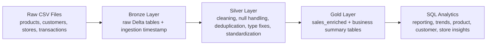

# Retail Sales Data Pipeline & Analytics

This project is an end-to-end batch data pipeline built with Python, PySpark, Delta Lake, and SQL for a retail business. The goal is to take messy retail sales data from raw CSV files, clean and standardize it, and turn it into analytics-ready tables that support daily reporting, monthly revenue tracking, top product analysis, customer behavior analysis, and store-level performance reporting.

The project is designed to feel like a real company data engineering project: structured, practical, business-focused, and production-minded, but still understandable and not overly complex.

## Business Scenario

A retail company receives transaction data from multiple systems along with supporting product, customer, and store reference data. The raw files are not ready for reporting because they contain:

- duplicate records
- missing values
- inconsistent text formatting
- invalid quantities or prices
- missing transaction totals

If this raw data is sent directly to analysts, dashboards will become unreliable. To solve this, the pipeline creates a clear transformation flow from raw data to trusted business tables.

## Project Goal

Build a batch pipeline that:

- ingests raw retail data
- stores it in a bronze layer for traceability
- cleans and standardizes it in a silver layer
- produces business-ready gold tables for analytics
- supports SQL-based reporting for business users

## Architecture

The project uses a medallion-style design:

1. `raw`
Raw CSV files for products, customers, stores, and transactions.

2. `bronze`
Landing layer stored in Delta Lake. This keeps raw records with an ingestion timestamp so the pipeline has a traceable source layer.

3. `silver`
Cleaned and standardized tables. This is where null handling, deduplication, type fixing, and text normalization happen.

4. `gold`
Analytics-ready tables used for reporting and business analysis.

### Simple Architecture Diagram



## Project Structure

```text
.
├── data/raw/
│   ├── customers.csv
│   ├── products.csv
│   ├── stores.csv
│   └── transactions.csv
├── sql/
│   └── business_queries.sql
├── src/retail_pipeline/
│   ├── __init__.py
│   ├── config.py
│   ├── pipeline.py
│   ├── schemas.py
│   ├── spark_utils.py
│   └── transformations.py
├── tests/
│   ├── conftest.py
│   └── test_transformations.py
├── output/
├── pyproject.toml
├── requirements.txt
└── run_pipeline.py
```

## End-to-End Flow

The pipeline runs in three main stages:

1. Read CSV files into Spark using predefined schemas.
2. Write raw input into Delta bronze tables.
3. Clean the bronze tables and write standardized silver tables.
4. Join cleaned dimensions and facts into a gold sales model.
5. Build business summary tables for reporting and SQL analysis.

## Three Real Problems Solved

Below are three company-level problems this project solves. They are realistic data engineering problems you would often face in a retail analytics environment.

### 1. Problem: Raw data was inconsistent across systems

The retail data came from different source systems, so the same type of field could appear in different formats:

- `electronics`, `ELECTRONICS`, and ` electronics `
- payment methods with inconsistent casing and spaces
- duplicate dimension records
- missing product categories and customer attributes

This creates a serious reporting problem because grouping and filtering become unreliable. For example, if `Electronics` appears in three different formats, revenue by category becomes incorrect.

#### How I solved it

I created reusable text-standardization helpers and applied them consistently in the silver layer:

```python
def normalize_whitespace(column_name: str):
    return F.regexp_replace(F.trim(F.col(column_name)), r"\s+", " ")


def titlecase_text(column_name: str):
    return F.initcap(F.lower(normalize_whitespace(column_name)))


def uppercase_text(column_name: str):
    return F.upper(normalize_whitespace(column_name))
```

Then I used them inside the dimension cleaning logic:

```python
def clean_products(products_df: DataFrame) -> DataFrame:
    return (
        products_df.dropDuplicates(["product_id"])
        .filter(F.col("product_id").isNotNull())
        .withColumn("product_name", titlecase_text("product_name"))
        .withColumn(
            "category",
            F.when(F.col("category").isNull(), F.lit("Unknown")).otherwise(
                titlecase_text("category")
            ),
        )
        .withColumn(
            "subcategory",
            F.when(F.col("subcategory").isNull(), F.lit("Unknown")).otherwise(
                titlecase_text("subcategory")
            ),
        )
    )
```

#### Why this matters in a company project

This is important because reporting teams need clean dimensions before they can trust category trends, customer segmentation, or store performance analysis. The solution is practical and common in real teams: standardize once in the pipeline, then reuse the cleaned data everywhere.

### 2. Problem: Transaction records were incomplete or unreliable for revenue reporting

In real retail systems, transaction data is often messy:

- `total_amount` may be missing
- quantity may be null or invalid
- discount percentages may be missing
- duplicate transactions may appear
- invalid records can inflate or distort revenue metrics

If the transaction layer is not repaired carefully, daily revenue, monthly growth, and average order value all become incorrect.

#### How I solved it

I built transaction cleaning logic that:

- removes duplicate transaction IDs
- rejects invalid records with missing required keys
- fixes missing quantity and discount values
- recalculates `total_amount` when it is missing or incorrect
- creates `transaction_date` and `year_month` fields for reporting

```python
def clean_transactions(transactions_df: DataFrame) -> DataFrame:
    cleaned = (
        transactions_df.dropDuplicates(["transaction_id"])
        .filter(
            F.col("transaction_id").isNotNull()
            & F.col("customer_id").isNotNull()
            & F.col("store_id").isNotNull()
            & F.col("product_id").isNotNull()
        )
        .withColumn("transaction_ts", F.to_timestamp("transaction_ts"))
        .withColumn("quantity", F.coalesce(F.col("quantity"), F.lit(1)))
        .withColumn("unit_price", F.coalesce(F.col("unit_price"), F.lit(0.0)))
        .withColumn("discount_pct", F.coalesce(F.col("discount_pct"), F.lit(0.0)))
        .filter(
            F.col("transaction_ts").isNotNull()
            & (F.col("quantity") > 0)
            & (F.col("unit_price") > 0)
        )
    )

    return (
        cleaned.withColumn(
            "total_amount",
            F.when(
                F.col("total_amount").isNull() | (F.col("total_amount") <= 0),
                F.round(
                    F.col("quantity")
                    * F.col("unit_price")
                    * (F.lit(1) - F.col("discount_pct")),
                    2,
                ),
            ).otherwise(F.round(F.col("total_amount"), 2)),
        )
        .withColumn("transaction_date", F.to_date("transaction_ts"))
        .withColumn("year_month", F.date_format("transaction_ts", "yyyy-MM"))
    )
```

#### Why this matters in a company project

This is the type of logic that makes finance and business dashboards trustworthy. Instead of only dropping bad records, the pipeline repairs what can be repaired and filters what should not be trusted. That is a realistic middle ground for a business-facing batch pipeline.

### 3. Problem: Business users needed reporting tables, not just cleaned data

A common project mistake is stopping at cleaned tables. In practice, analysts and reporting teams want ready-to-use datasets:

- daily revenue trends
- monthly revenue and growth
- top-selling products
- customer purchase behavior
- store performance summaries

If the pipeline only delivers cleaned raw tables, analysts still have to rebuild logic repeatedly in notebooks or dashboards.

#### How I solved it

I created a gold layer that joins the cleaned fact and dimension tables into one enriched sales dataset, then derives reporting summaries from it.

The enrichment step:

```python
def build_sales_enriched(
    transactions_df: DataFrame,
    products_df: DataFrame,
    customers_df: DataFrame,
    stores_df: DataFrame,
) -> DataFrame:
    return (
        transactions_df.alias("t")
        .join(products_df.alias("p"), on="product_id", how="left")
        .join(customers_df.alias("c"), on="customer_id", how="left")
        .join(stores_df.alias("s"), on="store_id", how="left")
        .select(
            "transaction_id",
            "transaction_ts",
            "transaction_date",
            "year_month",
            "customer_id",
            F.concat_ws(" ", F.col("c.first_name"), F.col("c.last_name")).alias(
                "customer_name"
            ),
            "store_id",
            F.col("s.store_name").alias("store_name"),
            "product_id",
            "product_name",
            "category",
            "quantity",
            "unit_price",
            "discount_pct",
            "total_amount",
        )
    )
```

The monthly growth logic:

```python
def build_monthly_revenue_summary(sales_enriched_df: DataFrame) -> DataFrame:
    monthly_sales = (
        sales_enriched_df.groupBy("year_month")
        .agg(F.round(F.sum("total_amount"), 2).alias("monthly_revenue"))
        .orderBy("year_month")
    )

    growth_window = Window.orderBy("year_month")

    return (
        monthly_sales.withColumn(
            "previous_month_revenue",
            F.lag("monthly_revenue").over(growth_window),
        )
        .withColumn(
            "revenue_growth_pct",
            F.round(
                (
                    (F.col("monthly_revenue") - F.col("previous_month_revenue"))
                    / F.col("previous_month_revenue")
                )
                * 100,
                2,
            ),
        )
    )
```

#### Why this matters in a company project

This turns the pipeline into a usable analytics product, not just a cleaning script. The gold layer reduces repeated business logic, improves consistency across teams, and makes dashboard development faster.

## How the Pipeline Is Organized in Code

### 1. Schema management

I defined explicit schemas in [schemas.py](/Users/babamalik/Documents/Playground/src/retail_pipeline/schemas.py) so the data types are controlled during ingestion instead of relying on automatic inference. This is important in business pipelines because schema inference can introduce inconsistent types across runs.

### 2. Bronze ingestion

The bronze layer is created in [pipeline.py](/Users/babamalik/Documents/Playground/src/retail_pipeline/pipeline.py) using a source mapping:

```python
def ingest_bronze_layer(spark, paths: PipelinePaths) -> None:
    sources = {
        "products": (paths.raw_dir / "products.csv", PRODUCTS_SCHEMA),
        "customers": (paths.raw_dir / "customers.csv", CUSTOMERS_SCHEMA),
        "stores": (paths.raw_dir / "stores.csv", STORES_SCHEMA),
        "transactions": (paths.raw_dir / "transactions.csv", TRANSACTIONS_SCHEMA),
    }

    for table_name, (file_path, schema) in sources.items():
        df = read_csv(spark, file_path, schema).withColumn(
            "ingestion_timestamp",
            F.current_timestamp(),
        )
        write_delta(df, paths.bronze_table_path(table_name))
```

This is a clean company-style pattern because the ingestion logic is reusable and easy to extend when new tables are added.

### 3. Silver transformations

The silver layer is handled in dedicated transformation functions:

- `clean_products()`
- `clean_customers()`
- `clean_stores()`
- `clean_transactions()`

This separation makes the code easier to test and maintain. Instead of placing all business logic in one large script, each dataset has its own cleaning function.

### 4. Gold analytics layer

The gold layer creates final reporting datasets:

- `sales_enriched`
- `daily_sales_summary`
- `monthly_revenue_summary`
- `top_selling_products`
- `customer_behavior_summary`
- `store_sales_summary`

These outputs are built from reusable functions so analysts can depend on stable business definitions.

## SQL Analytics Supported

The SQL file in [sql/business_queries.sql](/Users/babamalik/Documents/Playground/sql/business_queries.sql) contains reporting queries for:

- daily sales performance
- monthly revenue and growth
- top-selling products
- customer spending behavior
- category-level revenue trends
- store-level performance

This mirrors how a company project often works: the pipeline team prepares trusted tables, and analysts or BI tools query those tables directly.

## Sample Data Design

The raw data intentionally includes realistic quality issues so the pipeline demonstrates meaningful engineering work:

- duplicate `product_id`, `store_id`, and `transaction_id`
- inconsistent category text and mixed-case strings
- null customer age and city values
- missing transaction totals
- invalid transaction quantity

These issues are not extreme, but they are realistic enough to show practical problem solving.

## Setup

Create a virtual environment and install dependencies:

```bash
python3 -m venv .venv
source .venv/bin/activate
pip install -r requirements.txt
```

Spark also requires Java. Confirm Java 11+ is installed:

```bash
java -version
```

If Java is missing, install it and set `JAVA_HOME`.

## Run the Pipeline

```bash
python3 run_pipeline.py
```

The pipeline writes Delta Lake outputs under:

- `output/lakehouse/bronze/`
- `output/lakehouse/silver/`
- `output/lakehouse/gold/`

## Gold Outputs

The final business-ready tables are:

- `sales_enriched`
- `daily_sales_summary`
- `monthly_revenue_summary`
- `top_selling_products`
- `customer_behavior_summary`
- `store_sales_summary`

## Example Gold Output Tables

Below are small sample outputs produced from the provided retail dataset after applying the pipeline rules.

### 1. `daily_sales_summary`

| transaction_date | total_orders | unique_customers | items_sold | daily_revenue | average_order_value |
| --- | ---: | ---: | ---: | ---: | ---: |
| 2025-01-03 | 2 | 2 | 3 | 55.37 | 27.69 |
| 2025-01-04 | 1 | 1 | 1 | 53.99 | 53.99 |
| 2025-01-05 | 2 | 2 | 5 | 76.95 | 38.47 |
| 2025-01-07 | 1 | 1 | 2 | 23.75 | 23.75 |
| 2025-01-08 | 1 | 1 | 1 | 42.49 | 42.49 |
| 2025-01-09 | 2 | 2 | 5 | 84.95 | 42.48 |

This table helps business users track how many orders were placed each day, how many customers bought something, how many items were sold, and how much revenue was generated.

### 2. `monthly_revenue_summary`

| year_month | monthly_revenue | previous_month_revenue | revenue_growth_pct |
| --- | ---: | ---: | ---: |
| 2025-01 | 361.49 | null | null |
| 2025-02 | 414.10 | 361.49 | 14.55 |
| 2025-03 | 159.18 | 414.10 | -61.56 |

This table is useful for trend reporting because finance and leadership teams usually want revenue summarized monthly with a simple growth view.

### 3. `top_selling_products`

| sales_rank | product_id | product_name | category | units_sold | total_revenue | orders_count |
| ---: | --- | --- | --- | ---: | ---: | ---: |
| 1 | P004 | Running Shoes | Sportswear | 2 | 113.98 | 2 |
| 2 | P012 | Travel Backpack | Accessories | 2 | 104.48 | 2 |
| 3 | P005 | Yoga Mat | Fitness | 4 | 97.46 | 2 |
| 4 | P007 | Coffee Maker | Home Appliances | 2 | 92.48 | 2 |
| 5 | P009 | Notebook Set | Stationery | 9 | 89.91 | 2 |

This output is designed for merchandising and category teams that need to identify high-performing products by both unit volume and revenue.

